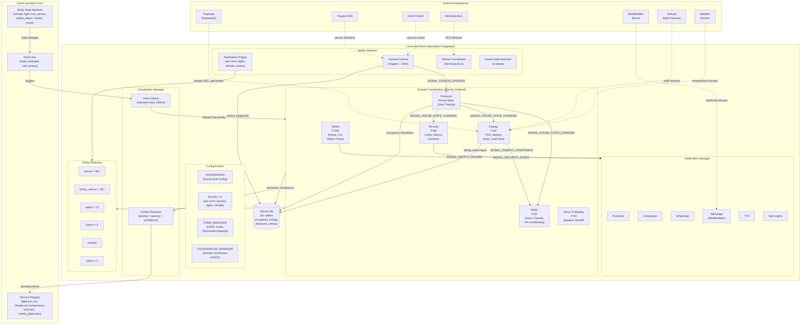
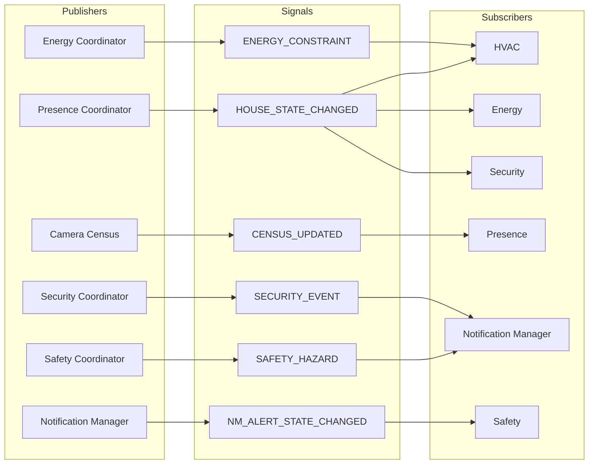
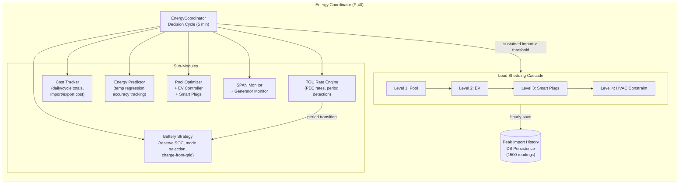
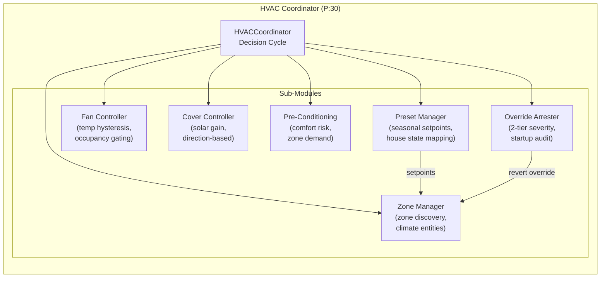
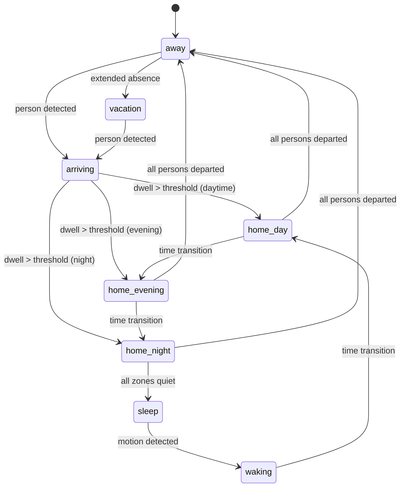
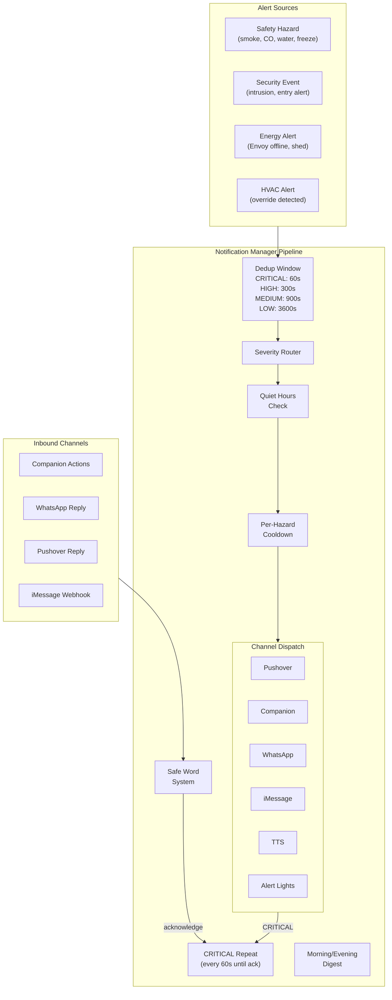
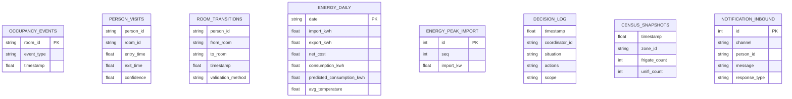

# URA Architecture Overview

## System Architecture

## Coordinator Signal Flow

## Energy Coordinator Internal Architecture

## HVAC Coordinator Internal Architecture

## House State Machine

## Notification Alert Pipeline

## Data Persistence Model

