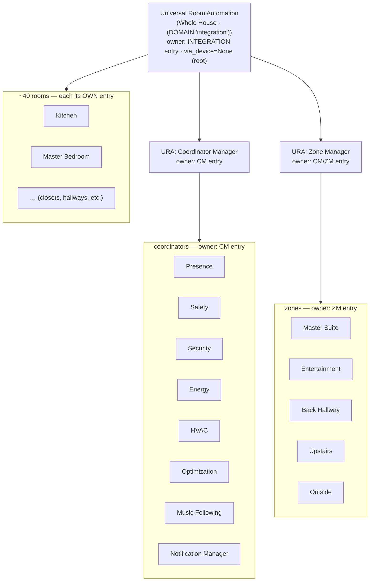

# URA Device & Entity Architecture — the final tree (v5.94.x)

**Status:** current as of v5.94.1 (2026-09-04). This is the canonical reference for how URA's
Home Assistant **config entries**, **devices**, and **entities** relate. Read it before touching
`_devices.py`, any platform `async_setup_entry`, or `DeviceInfo` construction.

> **The single most important idea:** *config-entry ownership* and *device-tree nesting* are **two
> independent axes.** Confusing them caused a full session of misdiagnosis (see the postmortem,
> linked below). Read §1 and §2 as separate things.

---

## 1. Config-entry ownership (who *owns* a device — reload boundary)

URA is ONE integration with **multiple config entries**, each a separate reload unit:

| Config entry type | Count | Owns these devices | Reload effect |
|---|---|---|---|
| `ENTRY_TYPE_INTEGRATION` (parent, title "Universal Room Automation", `source=migration`) | 1 | **Whole House device only** (`(DOMAIN,"integration")`, ~80 entities) | reloads house-level census/aggregation |
| `ENTRY_TYPE_COORDINATOR_MANAGER` (CM) | 1 | **All coordinator devices** — Coordinator Manager, Presence, Safety, Security, Energy, HVAC, Optimization, Music Following, Notification Manager | reloads all coordinators |
| `ENTRY_TYPE_ZONE_MANAGER` (ZM) | 1 | **All zone devices** (`(DOMAIN,"zone_<name>")`) | reloads all zones |
| `ENTRY_TYPE_ROOM` | ~40 | **One room device each** (`(DOMAIN,<entry_id>)`) | reloads that one room |

**Platform forwarding** (`__init__.py` `async_setup_entry`, branch on `CONF_ENTRY_TYPE`):
- INTEGRATION forwards `INTEGRATION_PLATFORMS` = `[SENSOR, BINARY_SENSOR, SELECT, SWITCH, BUTTON, TIME]` — but every entity it creates targets the `(DOMAIN,"integration")` Whole House device (via `AggregationEntity`). **It forwards NO coordinator-identified entity** (this is the v5.94.0 de-fragmentation invariant — see §4).
- CM forwards `INTEGRATION_PLATFORMS + [NUMBER]`; all coordinator entities are created here.

The HA **Settings → Devices & Services** page groups devices **by config entry** — that is the
grouping the operator sees, and it reflects *ownership*, not the nesting in §2.

## 2. Device-tree nesting (`via_device_id` — display hierarchy only)

Independent of ownership, devices form a display tree via `via_device_id` (imperative
`dr.async_update_device(via_device_id=…)`, set by the D-NEST sweep in `_devices.py`):



ASCII (the same tree):

```
Universal Room Automation (Whole House)        [INTEGRATION entry · root, via=None]
├─ URA: Coordinator Manager                    [CM entry]
│    ├─ URA: Presence Coordinator              [CM entry]
│    ├─ URA: Safety Coordinator                [CM entry]
│    ├─ URA: Security Coordinator              [CM entry]
│    ├─ URA: Energy Coordinator                [CM entry]
│    ├─ URA: HVAC Coordinator                  [CM entry]
│    ├─ URA: Optimization Coordinator          [CM entry]
│    ├─ URA: Music Following Coordinator       [CM entry]
│    └─ URA: Notification Manager              [CM entry]
├─ URA: Zone Manager                           [ZM entry]
│    └─ Zone: <name> × N                        [ZM entry]
└─ <Room> × ~40                                 [each its OWN ROOM entry]
```

**Key consequence:** a coordinator device is *owned* by the CM entry (§1) **and** *nested under*
the CM device (§2). A room is owned by its own entry but nested under Whole House. Ownership sets
the reload boundary; `via_device_id` sets only the visual tree.

## 3. Home Assistant mechanics this depends on (verified against HA source)

- **`via_device` is imperative, not declarative.** HA **2026.9** made the deprecated declarative
  `DeviceInfo(via_device=…)` a hard `RuntimeError` ("Error adding entity None"). URA must set
  nesting only via `dr.async_update_device(device_id, via_device_id=…)`. There must be **zero**
  `DeviceInfo(via_device=…)` in the codebase. See the v5.92.3 hotfix and the postmortem.
  Ref: HA dev docs — [Device registry](https://developers.home-assistant.io/docs/device_registry_index/),
  [`DeviceInfo`](https://developers.home-assistant.io/docs/core/entity/#deviceinfo).
- **Same identifier → one index slot.** The device registry keys devices by `device.id`, but the
  identifier index (`_identifiers`) maps `identifier → ONE device`, last-writer-wins. So
  `async_get_device(identifiers=…)` returns only the indexed one. When two device records share an
  identifier (a bug state), code that resolves by identifier is nondeterministic — **iterate
  `dev_reg.devices.values()` (a `list()` snapshot) instead.**
- **HA never removes a device when its last entity moves to a different config entry.** A device's
  `config_entries` is cleared only on full entry *removal* (`async_clear_config_entry`, inside
  `_async_remove`), never on unload/reload. So re-homing entities to a new entry leaves the old
  device record as an empty orphan that must be **explicitly** removed.
- **`async_update_device(remove_config_entry_id=…)`** auto-deletes the device when that was its
  sole entry; otherwise it demotes. Removing a device resets its children's `via_device_id` to
  `None`, so re-stamp children after removing a parent.
  Ref: [Integration setup / config entries](https://developers.home-assistant.io/docs/config_entries_index/).

## 4. Invariants (enforced by tests + live validation)

- **INV-DEFRAG:** every coordinator entity is owned by the CM entry only; no coordinator entity is
  split across two entries; `entity_id`/`unique_id` are stable (no `_2` mints); no orphaned devices.
- **INV-NEST:** every coordinator device `via_device_id → CM → Whole House`; zones → ZM → Whole
  House; rooms → Whole House; the root (Whole House) has `via_device_id=None`; **zero declarative
  `via_device`.**
- **Shell-cleanup guard (v5.94.1):** an empty duplicate coordinator device is removed **only** when
  it has 0 entities **AND** `config_entries == {parent_entry_id}` (sole parent-owner) **AND** it is
  not CM-owned — iterate `values()`, remove by `device.id`, never by identifier lookup. This makes
  it impossible to delete a real (populated, CM-owned) coordinator device.

## 5. Where the code lives

| Concern | File:symbol |
|---|---|
| Canonical DeviceInfo helpers + PARENT_MAP + D-NEST sweep | `custom_components/universal_room_automation/_devices.py` |
| Entry-type routing / platform forwarding | `custom_components/universal_room_automation/__init__.py` `async_setup_entry` |
| Empty-shell cleanup + survivor re-index (v5.94.1) | `_devices.py:async_cleanup_parent_entry_shells` |
| Coordinator entity creation (CM branch) | `sensor.py` / `binary_sensor.py` / `number.py` / `aggregation.py` |
| Tests | `quality/tests/test_device_entity_architecture.py`, `test_device_entity_cm_hosted_behavioural.py` |

## Related docs
- **Mistakes & fixes across the arc:** [`docs/reviews/DEVICE_ENTITY_DEFRAG_POSTMORTEM.md`](../reviews/DEVICE_ENTITY_DEFRAG_POSTMORTEM.md)
- **Decision log (all adjudications):** [`docs/planning/DECISION_LOG_device_entity_cycle_2026_09_03.md`](../planning/DECISION_LOG_device_entity_cycle_2026_09_03.md)
- **Cycle plan:** [`docs/planning/PLANNING_device_entity_architecture_2026_9.md`](../planning/PLANNING_device_entity_architecture_2026_9.md)
- **Broader architecture map:** [`docs/reviews/URA_ARCHITECTURE_MAP.md`](../reviews/URA_ARCHITECTURE_MAP.md)
- READMEs: `docs/readmes/README_v5.92.3.md` (via_device hotfix), `README_v5.94.0.md` (de-frag), `README_v5.94.1.md` (shell cleanup).
