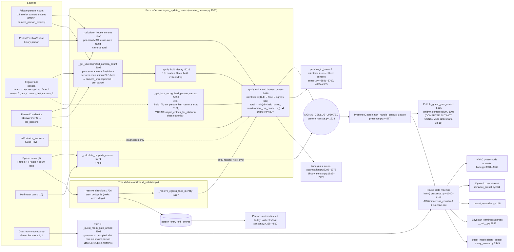

# AUDIT — Census subsystem review (2026-10-04)

**Type:** read-only audit (no code or HA changes). **Trigger:** operator: "census has been wrong all day" (2026-10-03).
**Canonical reference:** `docs/Coordinator/IDENTITY_FUSION_CAMERAS_MANUAL.md`; read with it.
**Data sources:** HA recorder (`/config/home-assistant_v2.db`, ro), URA DB (`census_snapshots`, `person_entry_exit_events`), live template eval at 2026-10-04 00:28 CDT, `.storage/core.config_entries` and `core.entity_registry` (ro). All times are CDT unless marked UTC.

## 0. Ground truth (operator)

- Residents: 4 tracked (`person.ezinne`, `oji_udezue`, `jaya`, `ziri`). Ziri was `not_home` all day. The other three came and went (tracker timeline in §1.2).
- One long-stay guest was already in the house.
- 8 guests arrived on 10-03 and stay until 10-04. A 9th arrived and left on 10-03.
- **Truth in the afternoon and overnight:** residents at home (1–3) + 9 guests ≈ **10–12 people**. Before the guests arrived (morning): 3 residents + 1 guest = **4**.
- The URA egress ledger puts the arrival burst around **12:00–13:30** (the `persons_entered_today` count went 20 → 52).

## 1. Measurement: what the census reported

### 1.1 `sensor.universal_room_automation_persons_in_house`, time-weighted hourly mean

| Hour (10-03) | Census mean | Truth (approx.) | Error |
|---|---|---|---|
| 00–07 | 3.0 | 4 (3 res + 1 guest) | **−1** (the long-stay guest is never counted) |
| 08–09 | 1.6–2.3 | 2–4 | −1 to −2 |
| 10–11 | 3.0 | 4 | −1 |
| 12 | 2.5 | 4 → ~12 | ramping |
| 13 | 3.1 | ~12 | **−9** |
| 14–16 | 2.2–2.6 | ~10–11 (Oji and Jaya out 14:03) | **−8** |
| 17–20 | 2.0–2.8 | ~10–11 | **−8** |
| 21–22 | 1.3–1.8 | ~10–12 | **−9 to −10** |
| 23–00 | 2.8–3.2 | ~12 | **−9** |

- **Direction:** a systematic UNDERCOUNT of about 75–85% once the guests arrived. The census never got above the resident count for long.
- **Peaks:** brief spikes to 7–9 (for example 14:xx max 9, 23:xx max 9). These came from a camera-visible crowd moment and fell away within minutes.
- **`identified_persons_in_house`** stayed at 1–3 all day. That is the BLE residents only.
- **`unidentified_persons_in_house`** was 0 most of the time. It was above 0 in 126 separate runs totalling 2.46 h over the whole day. The longest run was 521 s (18:23–18:32); the next were 399 s and 379 s.
- **`binary_sensor.ura_presence_coordinator_guest_mode`** was **never on**. The house state was **never GUEST**.
- **The house state went to AWAY from 15:57 to 17:00** with about 11 people inside. This lines up with an HA stop at 15:53 and restarts at 16:01 and 17:02.
- `census_snapshots` in the URA DB agrees: the house-zone hourly average was 1.4–3.0 and the maximum was 9.
- WiFi guest floor (`wifi_guest_floor` attribute): 5 at 13:xx–14:xx, then 0 from 15:00 onward. It is diagnostic only and not in the formula.

### 1.2 Resident trackers (for context)
- Ezinne: home, except 08:17–09:20 and 12:19–12:57.
- Oji: away 08:17–09:20, 14:03–15:42, and several short gaps after 21:39.
- Jaya: away 14:03–23:28.
- Ziri: away all day.

### 1.3 Egress ledger (`person_entry_exit_events`, 10-03 local day)
- **143 rows: 76 entries and 67 exits.** The truth is roughly 10 guest entries, 1 guest exit, plus resident trips.
- **58 of the 143 rows are same-camera duplicates less than 5 s apart.** The same physical crossing is logged under `binary_sensor.<cam>_person_detected` (Protect), `binary_sensor.<cam>_person_occupancy_2` (Frigate) and `sensor.<cam>_person_count`.
- Collapsing per base camera and direction gives about 86 logical events at a 5 s window and 73 at 60 s. That is roughly **2× inflation**.
- `garage_a` logs 17 entries and 15 exits identically under two entity ids.
- Identity attached on 34/143 rows. Every attach is advisory (0.6, `single_source`). One attach uses the non-canonical slug **`ojini`**: Frigate has a face-library entry "Ojini" (`sensor.frigate_ojini_last_camera`), which leaked through as a person_id.
- **Net entries − exits = +9 rows.** Ground-truth net is about +8. The flow ledger is noisy (and duplicated in both directions), yet its *net* tracked the truth far better than the snapshot census. **This is the most important empirical result in this audit.**

## 2. Architecture (producer → fusion → state → consumers)

### 2.1 Producer check (how each value is made)

| Value | Producer (file:line) | Dependency health on 10-03 |
|---|---|---|
| `camera_total` (raw) | `_calculate_house_census` `camera_census.py:1690–1965` (Frigate count, per-area max) | Healthy, but **only covers 12 camera entities across about 7 areas** (playroom, master hallway, staircase, foyer, family room, upstairs hall, stairs top). Kitchen, living, dining, media, game room, bedrooms and outdoors are not covered. |
| `camera_unrecognized` | `_get_unrecognized_camera_count` `:5198–5381` | Healthy, but tied to the same instantaneous visibility. `ble_cancelled_count` stayed 0 because no BLE resident was in a camera area. |
| `face_recognized` (names) | `_get_face_recognized_person_names` `:5550` → `_resolve_last_camera_entity_id` `:3263` → `_build_frigate_person_last_camera_map` `:3192` | **BROKEN.** `:3216` calls `er.async_entries_for_platform(registry, "frigate")`. **That function does not exist** in HA's entity registry (the HA 2026.2.3 venv has only `_for_device`, `_area`, `_label`, `_category`, `_config_entry`). The AttributeError is swallowed at `:3217` → map `{}` → rebuilt and empty every tick → every person fails closed. Recorder: **0 non-empty `face_recognized_persons` rows across the full retention window (09-26 → 10-04).** Live falsifier at 00:28: `frigate_oji_last_camera_2` age 1486 s and `jaya` age 912 s, both `person.*=home`, yet attr `face_recognized_persons=[]` with health `live`. Tests (`quality/tests/test_census_accuracy_d1_d2.py:347`, `test_egress_camera_dead_config.py:59`) **monkeypatch the non-existent function onto the module**: hollow anchor, Bug Class "fake API in test". Introduced in `8c97c0567` (CENSUS-ACCURACY-1 D2, ~2026-08-17). |
| `identified_count` | `_apply_enhanced_house_census` `:5681–5699` (BLE ∪ face ∪ egress-face) | BLE only in practice, because the face feed is dead. Egress-face registrations do occur (attach rate about 19–22% earlier in the day). |
| House `total` | `:5740–5754` `min(id + held_unrec, max(camera_pre_cancel, id))` | **Structurally capped at "people currently on camera, or known residents".** No memory of people who walked out of view. |
| Hold | `_apply_hold_decay` `:5026`; hold 3 min (`const.py:3528`), sustain 15 s (`:3544`), instant drop | Works as designed. That design is what makes guests "evaporate" 3 minutes after leaving camera view. |
| Egress events | `TransitValidator._on_camera_state_change` `:809–828` (physical dedup) and `_resolve_direction` `:1726–1740` (stem dedup, 5 s) | **Dedup leaks:** 58 sub-5 s duplicate rows. `_entity_to_physical` / stem do not unify `_person_detected` vs `_person_occupancy_2` vs `sensor.*_person_count`. |
| WiFi guests | `_get_wifi_guest_count` `:5383` | Recency filter `WIFI_GUEST_RECENCY_HOURS=4` (`const.py:3638`) drops guests who have been connected for more than 4 h. The value went 5 → 0 at 15:00 even though the guests stayed. Excluded from the formula anyway. |

### 2.2 Consumer check

**House state machine (trust):**
- `presence.py:~4577 _handle_census_update` reads `interior_count`, `unidentified_count`, `confidence`, `face_recognized_count`.
- The AWAY branch in `infer()` ("census_count == 0 and not any_zone_occupied") and path α both use `face_recognized_count`, which is permanently 0 because of the dead face feed.
- Path A guest gate `_guest_gate_armed` `:5355` is still evaluated, but **its result is not consumed**. `guest_armed = guest_room_gate_armed` at `:5891` (GUEST-CENSUS D2, 2026-08-16).
- **GUEST arming is guest-room only** (`_guest_room_gate_armed` `:5303`). Only Guest Bedroom 1 and 2 are flagged. During waking hours on 10-03 Guest Bedroom 1 never stayed occupied for 30 continuous minutes (its longest run was 20 min at 09:01). The 23:34–00:23 run (49 min) fell inside sleep hours, and GUEST entry sits below the sleep branch (`presence.py:1305`).

**GUEST consumers:**
- HVAC guest-mode actuation (`hvac.py:3931–3962`)
- dynamic preset reset (`dynamic_preset.py:861`)
- preset overrides (`preset_overrides.py:148`)
- Bayesian learning suppress (`__init__.py:2893`); learning was **not** suppressed during a 12-person party
- `binary_sensor.py:2445` (guest_mode), `:3255`

**Display:**
- persons/identified/unidentified sensors (`sensor.py:3581+`)
- zone guest counts (`aggregation.py:6296–6375`)
- `binary_sensor.py:1936–2225`
- entered/exited-today sensors (`sensor.py:4268–4512`); these show 91/74, about 2× inflated
- security `authorized_guests`, `outside_unidentified_people`

## 3. Chokepoints and failure points

**Good chokepoints** (single places where truth is formed; fix here):
1. **`_apply_enhanced_house_census` `:5740–5754`.** This is the only writer of the house total. Every consumer reads its output.
2. **`SIGNAL_CENSUS_UPDATED` payload (`:1638`).** This is the only path into presence and house state.
3. **`TransitValidator._resolve_direction`.** This is the only producer of door flow (entry/exit). Today it is display-only.
4. **`guest_armed` assignment in `presence.py:~5891`.** This is the only GUEST arming predicate.

**Failure points observed on 10-03:**

| # | Failure | Evidence | Impact |
|---|---|---|---|
| F1 | **Census is a snapshot of camera visibility, not a stock of people inside.** The ceiling is `max(camera_pre_cancel, identified)`. Hold is 3 min, then an instant drop. Coverage is about 7 areas. | Mean 2–3 vs truth 10–12. Unidentified > 0 only 2.46 h/day, in short runs. | **The primary undercount (−8 to −10).** |
| F2 | **GUEST arming = guest-room ≥30 min only.** The census path is computed but not consumed. Waking-hours guests in common areas can never arm it. | No guest-room run ≥30 min in waking hours; the census path's longest run of 521 s would have passed the 300 s persistence. | GUEST never entered, so the HVAC, preset and Bayesian consumers were all wrong. |
| F3 | **Dead face-name feed:** `er.async_entries_for_platform` does not exist; the tests fake it. | 0 non-empty rows in 8 days; live falsifier. | `face_recognized_count` is always 0. Path α and the corroboration bundle lose camera identity. It does **not** cause today's undercount, because BLE covers the residents. |
| F4 | **Egress dedup leak** across Protect / Frigate-binary / Frigate-count legs. | 58 sub-5 s duplicate rows; garage_a counted twice. | The flow ledger is about 2× inflated in both directions, which blocks using it as a stock integrator unless fixed. |
| F5 | **AWAY latched 15:57 → 17:00 with about 11 people home.** | `house_state` = away from 15:57:56. `people_home_census` stopped updating at 15:53 (HA stop at 15:53:47, start at 16:01:06). Persons_in_house after restart was 2–7. Exit came only through the 17:00 "arriving" path. | Mechanism not fully proven (logs are not retained). The most likely chain: shutdown-window census 0 → AWAY → restored, and AWAY does not exit on census > 0. Card it for log-armed verification. |
| F6 | Non-canonical identity slug `ojini` leaks into `person_entry_exit_events.person_id` from a Frigate face-library entry. | 1 row on 10-03; the slug appears across 11 face sensors. | Identity hygiene. Decide whether Ojini is a known guest (`known_face_guests` is empty) or an alias of Oji. |
| F7 | The long-stay guest (no BLE, no face enrollment) is invisible except when on camera. | Baseline −1 all morning. | Any phoneless occupant is structurally uncounted. |

**Alternatives falsified:**
- *"A camera outage caused it."* No: `frigate_count` stayed live all day, health `live`, `degraded_mode=false`, and the stuck-camera list was empty.
- *"BLE-cancel ate the guests."* No: `ble_cancelled_count` stayed 0 in every sample.
- *"The clamp suppressed them."* Only partly: when `camera_pre_cancel` spiked to 11, the total also spiked (to 9). The clamp follows visibility; the problem is that visibility itself is the wrong quantity.
- *"Face failure caused the undercount."* No: the face feed only affects the resident `identified` set, and BLE already provided 1–3.

## 4. Recommendations (ranked)

1. **R1 — Fix the dead face feed (Tier 1 hotfix).** Replace `er.async_entries_for_platform(registry, "frigate")` with an iteration over `registry.entities.values()` filtered on `platform == "frigate"` (or use `async_entries_for_config_entry` on the Frigate entry). Replace the fake-API monkeypatch in both tests with a real registry fixture, and add a mutation drill. This restores `face_recognized_count` for path α and corroboration. Cheap, and an unambiguous bug.

2. **R2 — Make the house count a STOCK, not a snapshot (Tier 2-DB / elevated; regression-prone across presence, HVAC and guest).**
   - Define `guests_inside` as an integrator over deduped door flow: entries − exits, reset/anchored when the house is verifiably empty (AWAY with all trackers away plus zero interior occupancy) and at a nightly settle.
   - Use the camera snapshot as a **floor** (`max(stock, visible_now)`), never as a ceiling.
   - Today's evidence: net flow +9 vs truth +8, while the snapshot was −8. **Measure first:** replay 2–4 weeks of `person_entry_exit_events` against known-empty anchors to quantify drift per day before building (Measure-Before-Build).
   - Show the stock as a separate sensor first (shadow), then promote it.

3. **R3 — Fix egress dedup before R2 (Tier 1–2).**
   - Key dedup on the resolver's physical camera (`CameraResolver` base_stem), across all three legs.
   - Use a direction-aware window of about 10–30 s. The measured gap histogram shows a cluster under 5 s plus a 5–30 s band.
   - Mandatory prerequisite for R2. It also fixes the 2× entered/exited-today display.

4. **R4 — Restore a census arm for GUEST alongside guest rooms (Tier 2; config-first check).**
   - `guest_armed = room_gate OR stock_gate`, where the stock gate is `guests_inside ≥ N for ≥ T` (knobs on the Number entity rung). Until R2 exists, the existing Path A `unid_gate_armed` with persistence is the stopgap the operator can enable.
   - The GUEST-CENSUS D2 rationale (FP from BLE-inflated census) is weaker now that dedup/clamp shipped. Re-measure Path A's FP rate over 30 days before re-wiring.
   - **Config-first, today:** an operator can use the house-state override select (`select.ura_presence_coordinator_house_state_override`) for known parties. A "guests expected until <date>" calendar or toggle is the simplest correct product answer for planned gatherings.

5. **R5 — Trace and fence the shutdown-window AWAY (Tier 1 investigate → fix).**
   - Arm debug logging on the presence infer() AWAY branch.
   - Suppress census-driven AWAY during the HA stop sequence and boot settle.
   - Add a "census_count ≥ 2 for 2 min while AWAY → ARRIVING" exit, or treat an AWAY that is contradicted by fresh interior occupancy as stale.

Also (lower priority):
- **R6:** canonicalize or deny-list unknown Frigate face-library names such as `ojini`, or map them to `known_face_guests` (Tier 1).
- **R7:** move `WIFI_GUEST_RECENCY_HOURS` onto the knob ladder, or switch to "joined since anchor" semantics; it can be a cheap corroborator for R2 (Tier 1).
- **R8:** extend interior camera coverage of kitchen/living/dining if hardware exists; that is config only (`camera_person_entities`).

### 4.1 Optional: AI-vision head-count (LLM Vision / OpenAI, already installed)

| Option | Mechanism | Cost (indicative) | Latency | Privacy |
|---|---|---|---|---|
| A. Periodic snapshot head-count | Every 10–15 min, send 4–6 common-area snapshots to LLM Vision and ask for a person count per image. Take per-area max and sum, and use the result as a corroborating floor for R2. | ~6 images × 96/day ≈ 600 images/day. With a small vision model and low-res images this is cents to low dollars per day (verify current pricing before building). | 3–10 s per call; asynchronous, outside the census tick. | Interior images of guests leave the house on cloud models. Prefer a local model (Ollama / LLaVA via LLM Vision) or limit it to an explicit "party mode". |
| B. Door-event image counting | On each deduped egress event, send the 1–3 frame clip to LLM Vision and ask "how many people, entering or leaving?" Gives group-size multiplicity, which Frigate binary legs lack: a family of 4 entering is one crossing today. | About 50–150 calls/day | Seconds; fine for a stock integrator | Exterior or door frames only, which is lower sensitivity. **Highest value**: fixes group under-count in R2's flow integrator. |
| C. Nightly reconcile | One whole-house snapshot sweep at the R2 anchor time to re-zero drift. | Trivial | n/a | Interior images; same caveat as A |

**Recommendation:** B (door group-size), only after R2 and R3 show that group multiplicity is the residual error. Use A only as an opt-in party-mode corroborator. Never use either as a trust input for security; they stay advisory and display/HVAC-grade only, in line with the manual's §5.5 safety doctrine.

## 5. Not verified / caveats
- HA core logs for 10-03 are not retained via SSH, so the F5 mechanism is inferred, not proven.
- Arrival times are inferred from the egress ledger, not operator-confirmed.
- Direction accuracy (entry vs exit labeling) of individual egress rows was not audited against video.
- The R2 drift rate is unmeasured; this is the gating probe for R2.
