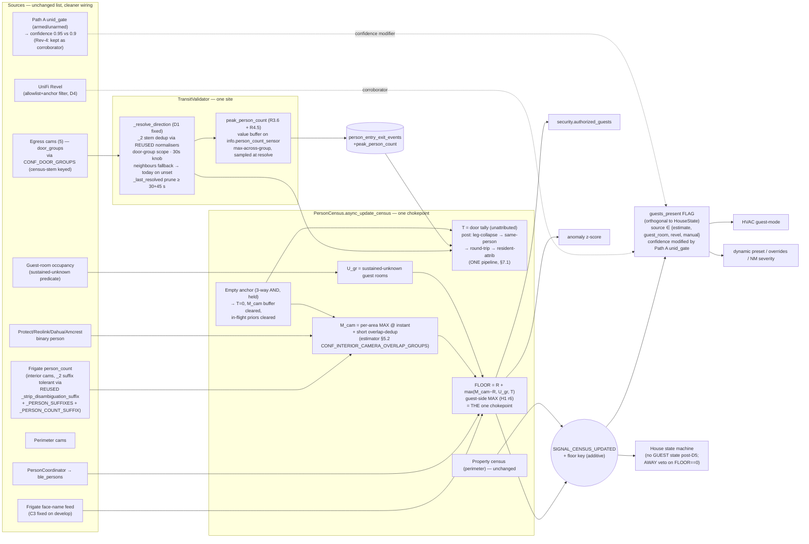

# DESIGN — Census subsystem simplification (show the work)

**Status:** DRAFT 2026-10-05 (not committed, not shipped). Companion to
`PLANNING_census_inputs_first.md` (Rev 3) +
`PLANNING_census_inputs_first_rev4.md` (Rev 4 appendix) and
`PLANNING_census_occupancy_estimator.md`.
**Operator ruling (2026-10-05):** "Rely on prior art where it is correct and
do not invent duplicate concepts. The state and arch diagram is a mess —
simplify where possible but show the work and the gains from it."
**Reads prerequisite:** `IDENTITY_FUSION_CAMERAS_MANUAL.md` (canonical);
`AUDIT_census_subsystem_2026_10_04.md` (current-state Mermaid at §2);
inputs-first Rev 3 (R3.0–R3.14); Rev 4 (R4.1–R4.10); estimator plan (hybrid
formula, D5/D6 tables).

Three bucket triage per CLAUDE.md: **KEEP** / **MERGE-INTO-X** /
**DELETE** (dead AND no use case AND footgun) / **FIX**. Dead ≠ delete.

**Rev-4 note (2026-10-05 PM):** post re-review FIX-PLAN, §1.1 C3 verdict
and §1.3 C13 verdict changed; §3 GAINS table recomputed; §5 "unset
CONF_DOOR_* byte-identical" clarified. See **§6 Revision 4 corrections**
at the end of this file for the authoritative current verdicts. §1–§5
below are retained for history where in conflict with §6.

---

## 1. Current map — component ledger with verdicts

Pulled from the audit Mermaid (§2 of `AUDIT_census_subsystem_2026_10_04.md`)
plus a re-grep against develop. One row per node/edge concept.

### 1.1 Producers (camera_census.py and friends)

| # | Component | File:line | Consumers (verified) | Verdict | Rationale |
|---|---|---|---|---|---|
| C1 | `_calculate_house_census` (raw per-area max → `camera_total`) | `camera_census.py:1690` | `_apply_enhanced_house_census :5681-5754` | **KEEP + FIX** | Sole producer of raw interior count. Dedup rule stays; estimator plan replaces `M_cam` definition with per-area-max-at-instant + short hold (R2.4 / estimator §7.2). |
| C2 | `_get_unrecognized_camera_count` (per-camera minus fresh face, minus BLE-here) → `camera_unrecognized`, `camera_total_pre_cancel` | `:5198-5381` | `:5661`, `:5728-5748` | **MERGE-INTO estimator FLOOR** (Rev-4 wording; was "MERGE-INTO-C9") | Produces TWO numbers (`camera_unrecognized`, `camera_total_pre_cancel`) that the estimator's single FLOOR term `max(M_cam − R, 0)` subsumes. BLE-cancellation + resident subtraction live inside the estimator's one chokepoint (per CR-2 of the estimator plan: "residents subtracted ONCE from the camera term"). Legacy `pre_cancel` attribute goes KEEP+DOCUMENT (observability) until estimator ships. |
| C3 | `_build_frigate_person_last_camera_map` → face-name resolver | `:3192-3263` | `_get_face_recognized_person_names :5550` → `_apply_enhanced_house_census` | **FIX LANDED on develop (verify-only; Rev-4)** — was "FIX (R1 hotfix, dead face feed)" | Face-lookup fix is already merged on develop at `camera_census.py:3215-3222`. No code change this cycle. See §6 R6.2. |
| C4 | `_apply_hold_decay` (15 s sustain, 3 min hold, instant drop) | `camera_census.py:5034` | `:5716` (unidentified hold), `:5799` (property hold) | **KEEP + CLARIFY SCOPE** | Only ONE hold mechanism in code — the audit's "two hold mechanisms" claim refers to (a) this one and (b) the estimator's PROSPECTIVE `FLOOR_WINDOW_S` (held camera max, 1200 s default). Those are different-purpose, different-scope (per-camera smoother vs house-wide FLOOR memory). KEEP C4 as the per-camera smoother; estimator introduces `FLOOR_WINDOW_S` additively — do NOT fold or rename. Document this in `IDENTITY_FUSION_CAMERAS_MANUAL.md` to kill the recurring "duplicate hold" confusion. |
| C5 | `_apply_enhanced_house_census` (chokepoint: `total = min(id + held_unrec, max(camera_pre_cancel, id))`) | `:5638-5770` | SIGNAL_CENSUS_UPDATED | **FIX (chokepoint replacement, D6)** | THE chokepoint. Current clamp = "visible-now ceiling" (audit F1). Estimator D6 keeps this method as the single writer but changes the formula to FLOOR = `R + max(M_cam−R, U_gr, T)` and adds additive `floor` key. Byte-identical on D6-OFF. |
| C6 | `_calculate_property_census` (perimeter, with its own hold) | `:1971` | SIGNAL_CENSUS_UPDATED → security | **KEEP** | NOT a duplicate of house census — different scope (perimeter rings) and different consumers (security/perimeter). The audit diagram listing it next to house census creates the impression of duplication; it is a sibling, not a copy. |
| C7 | `_get_wifi_guest_count` (Revel SSID, 4-hour recency) | `:5383-5548` | `_apply_enhanced_house_census` `_wifi_guest_floor` attr | **KEEP + DOCUMENT (dormant) → FIX (D4)** | Diagnostic-only today (not in formula). Estimator D4 FIXES filter (hostname denylist + MAC allowlist + "since last empty anchor"). Code stays; semantics change. Retire `WIFI_GUEST_RECENCY_HOURS` on D4 ship (per `KEEP + DOCUMENT` bucket in estimator §2.1). |

### 1.2 Door / egress pipeline (transit_validator.py)

| # | Component | File:line | Consumers | Verdict | Rationale |
|---|---|---|---|---|---|
| C8 | `_resolve_direction` + `_get_interior_cameras_near` | `transit_validator.py:1724-1963` | ledger write `:1879`, census register/evict `:1840`, notify `:1812`, face identity resolver `:1253` | **FIX (D1 — four changes in one site)** | Single site, four fixes: (i) `_extract_camera_stem` strip `_person_occupancy_2`/`_person_count_2` via REUSED `_strip_disambiguation_suffix` **composed with `_PERSON_SUFFIXES + (_PERSON_COUNT_SUFFIX,)`** (R3.3 + Rev-4 R4.1); (ii) 30 s `DOOR_STEM_DEDUP_S` knob (R3.9); (iii) door-group dedup scope (R2.2 item 4); (iv) newest-first neighbour window with `CONF_DOOR_INTERIOR_NEIGHBOURS` fallback to today's full-interior-set on unset (R3.1). The `_last_resolved` prune ties to **`DOOR_STEM_DEDUP_S + ENTRY_WINDOW_SECONDS`** (Rev-4 R4.2). No new site; same chokepoint. |
| C9 | Door ledger direction/dedup (duplicated in `_resolve_direction` AND documented in `camera_census._resolve_ble_legs` lead-window logic) | `transit_validator.py:1724` / `camera_census.py:4497-4555` | — | **NOT duplicate — KEEP both** | Audit implied duplication. In fact: `_resolve_direction` is the DIRECTION resolver; `_resolve_ble_legs` is the IDENTITY-leg attach helper. They read the same event but produce disjoint outputs (direction vs person_id). Documenting as "two concepts, one event" in the manual kills the duplication smell. |
| C10 | Stem dedup inline literal `5.0` | `transit_validator.py:1736` | — | **FIX → named knob** | Numbers-Get-Knobs violation. Becomes `DOOR_STEM_DEDUP_S` (default 30 s) in D1. |
| C11 | Ledger `person_entry_exit_events` | `database.py:4041-4066` | 10 downstream readers (sensor.py restore + 4 bus-listener sensors; BLE backfill `:4099-4177`; estimator replay) | **KEEP + EXTEND** | Add `peak_person_count INTEGER` to BOTH the fresh-install CREATE at `database.py:928` AND the ALTER migration (Rev-4 R4.5). Sampler consumes `info.person_count_sensor` via `census.get_transit_egress_entities()` (`camera_census.py:960-969`) with an in-process value buffer; no string-built entity ids. Idempotent `ALTER TABLE … ADD COLUMN` per existing precedent (`database.py:972/1819/1957/2012/2057`). Non-dup. |

### 1.3 Identity union + guest arming (presence.py, camera_census.py)

| # | Component | File:line | Consumers | Verdict | Rationale |
|---|---|---|---|---|---|
| C12 | Identified union = BLE ∪ face-name ∪ egress-face | `camera_census.py:5681-5699` | `_apply_enhanced_house_census` | **KEEP + FIX (via C3 landed on develop)** | NOT three competing paths — it is a documented UNION. The audit's "identified union paths (BLE/face/egress-face)" is one function; C3 fix is already merged on develop. Keep the union; delete nothing. |
| C13 | **Path A guest gate** `_guest_gate_armed` | `presence.py:5355` | **LIVE** — called `presence.py:5878`; `unid_gate_armed` discriminates `_d5_guest_confidence = 0.95` (armed) vs `0.9` (unarmed) at `:5914` → inference engine `:6468`; teardown `:4973-4976`; side effects `:5405-5455`. (Rev-4: Rev-3 "NONE at runtime" claim retracted — see §6 R6.1.) | **MERGE-INTO D5 flag as confidence corroborator** (Rev-4; was "DELETE") | Live confidence modifier. Deletion was wrong — would silently drop the 0.95→0.9 confidence tier. The `HouseState.GUEST` transition it feeds is removed by D5; the arming predicate body stays and is re-wired to publish `source=unid_gate` or stay as a confidence modifier on `source=estimate` (D5 reviewer's call). Kill-switch REUSE `switch.ura_presence_guest_detection_enabled` → re-point switch to gate the confidence contribution. |
| C14 | **Path B guest gate** `_guest_room_gate_armed` (30 min sustained-unknown-occupied) | `presence.py:5303` | `presence.py:5885` (sole GUEST arm) | **KEEP → MERGE-INTO D5 flag as `source=guest_room`** | Live arm today. Estimator D5-2 migrates it to flag `source=guest_room`, orthogonal to house state. House-state transition dies; predicate stays. |

### 1.4 House-state consumers

| # | Component | File:line | Verdict | Rationale |
|---|---|---|---|---|
| C15 | 16 real `HouseState.GUEST` readers | estimator §6.2.a D5-1..D5-16 | **FIX (D5 migration)** | Each site reads flag instead of state; `HouseState.GUEST` enum deprecated one minor release then removed. Zero duplicate concepts; one semantic shift. |
| C16 | 21 `total_persons` / `census_count` readers | estimator §6.2.b D6-1..D6-21 | **FIX (D6 semantic shift)** | Payload shape unchanged (int). `interior_count` key byte-identical; additive `floor` key. |

### 1.5 Diagram-level duplicate concepts the audit flagged — adjudicated

| Flagged duplicate | Verdict | Evidence |
|---|---|---|
| "Two hold mechanisms" (`_apply_hold_decay` vs estimator FLOOR hold) | **NOT duplicate** | C4 (per-camera smoother, 3 min) vs `FLOOR_WINDOW_S` (house-wide FLOOR memory, 1200 s). Different scope, different purpose. Document in manual. |
| `camera_total` vs `camera_unrecognized` vs `camera_pre_cancel` | **MERGE-INTO estimator FLOOR (D6)** | Three publishings of adjacent arithmetic from one function (C2). Estimator FLOOR term `max(M_cam − R, 0)` is their one true replacement; legacy attributes KEEP+DOCUMENT for observability through the D3 shadow period, then DELETE at D6 ship. |
| Identified union paths (BLE / face / egress-face) | **NOT duplicate** | One function (C12). The appearance of three paths is a UNION, not three competing writers. |
| Path A guest gate vs Path B | **Rev-4 (both MERGE):** Path A (C13) MERGE-INTO D5 flag as confidence corroborator; Path B (C14) MERGE-INTO D5 `source=guest_room` | File:line evidence above + §6 R6.1. |
| WiFi Revel diagnostics (`_wifi_guest_floor` 5 → 0 at 15:00) | **KEEP + FIX (D4)** | Attribute diagnostic today; estimator D4 upgrades filter. Non-duplicate (nothing else emits WiFi-sourced guest count). |
| Property vs house census | **NOT duplicate — sibling scopes** | C1 (interior) vs C6 (perimeter). Both produce `total_persons` but into DIFFERENT keys (`interior_count` vs `property_count`) with DIFFERENT consumers. |
| Door ledger direction/dedup "duplicated in transit_validator vs census" | **NOT duplicate** (C9) | Direction resolver vs identity-leg attach helper; disjoint outputs on the same event. Manual gets a one-paragraph section to end the recurring confusion. |

---

## 2. Target map — simplified Mermaid (after inputs-first D1 + hybrid D3-D6)

Fewest components: **one producer per value, one chokepoint (FLOOR), one
orthogonal flag (with Path A as its confidence corroborator), one
door-event site.**

---

## 3. GAINS — before / after (Rev-4 recomputed)

| Dimension | Before (today) | After (D1 + hybrid landed) | Delta |
|---|---|---|---|
| **Diagram nodes (producers)** | 11 (RAW, UNREC, FACEN, HOLD, ENH, PROP, DIR, EID, Path A, Path B, hold-decay) | 8 (M_cam, U_gr, T, FLOOR, anchor, direction, peak, property) — Path A kept as confidence corroborator feeding FLAG, not counted as separate producer node | **−3** |
| **Published count-adjacent values** | `camera_total`, `camera_unrecognized`, `camera_total_pre_cancel`, `area_raw_max_pre_cancel`, `total_persons`, `interior_count` (6) | `interior_count` (byte-identical), additive `floor`, `estimate_band`, retired at D6 ship: 3 `pre_cancel` legacy attrs → observability-only, deleted next cycle | **−3 published** at D6+1 |
| **Guest-arming predicates** | 2 (Path A live confidence corroborator; Path B live GUEST arm) | 2 producers, both feeding the single D5 flag (Path A → confidence modifier; Path B → `source=guest_room`) | **−1 house-state transition; 0 producers deleted** (Rev-4 retraction of "−1 dead code path"; see §6 R6.1) |
| **House-state enum members** | 8 incl. `GUEST` | 7 (`GUEST` removed one release after D5 ship) | **−1** |
| **`HouseState.GUEST` string / enum readers** | 16 (D5 table) | 0 | **−16 call-sites touching state for guest-ness** |
| **`_last_camera_total_pre_cancel` / `_last_area_raw_max_pre_cancel` observability attrs** | 2 instance attrs + 2 sensor attrs | DELETED one cycle post-D6 | **−4** |
| **Dead-code lines (Path A `_guest_gate_armed`)** | ~70 lines (`presence.py:5355` + helpers) — **LIVE on Rev-4** | STAYS LIVE | **0 LoC removed** (Rev-4 retraction) |
| **Direction-resolver code paths** | 2 (`_resolve_direction` + its degenerate "ALL interior cams" fallback) | 1 (narrowed on configured, byte-identical fallback on unset — one branch) | **−1 effective path** |
| **Stem-matching rules** | hand-maintained in `_extract_camera_stem` + `_PERSON_SUFFIXES` (duplicated knowledge) | REUSED composed normalisers (`_strip_disambiguation_suffix` + `_strip_suffix` over `_PERSON_SUFFIXES + (_PERSON_COUNT_SUFFIX,)`) — single source of truth per manual §1.1 | duplicate concept **eliminated** |
| **Bug classes closed** | #22 (enum/suffix mismatch — `_2` + `_person_count`), #23 (observation-mode gating — AWAY-while-occupied), the "fake-API test anchor" class. **(#7 face-map `{}` retired pre-cycle on develop — Rev-4 R6.2 attribution.)** | — | **4 bug classes retired or defused** (Rev-4: was 5; "#53 Path A" retracted — Path A IS consumed) |
| **Test surface** | — | +10 behavioural tests enumerated in D1 / estimator plans / Rev-4 R4.1/R4.2/R4.5 | **+10 behavioural** (Rev-4: "−2 hollow anchors" dropped — those tests were migrated when C3 face-lookup fix landed on develop) |
| **Code paths removed (LoC estimate)** | — | `pre_cancel` attribute block + sensor attr ~25 LoC; `WIFI_GUEST_RECENCY_HOURS` + 4h filter ~15 LoC; `HouseState.GUEST` enum branch + hysteresis ~40 LoC | **~80 LoC removed** (Rev-4: was ~150; Path A ~70 LoC retracted) |

**Measurement caveat:** LoC are grep-based estimates from `camera_census.py`
`pre_cancel` attribute writers + sensor attrs at `sensor.py:3707-3717`, and
`house_state.py:60-139`. Final cuts confirmed at delete-PR time.

---

## 4. Sequencing — which simplifications ride which cycle

Per CLAUDE.md soak-exit discipline: simplifications ride with the cycle
that already touches the surface; stand-alone cleanup cycles only for
items with no natural carrier.

### 4.1 Inside the inputs-first build (D1, Tier 2-DB — PLANNING_census_inputs_first.md Rev 3 + Rev 4)

| Simplification | Carrier | Prior art REUSED |
|---|---|---|
| `_extract_camera_stem` `_2`-suffix + `_person_count` fix | R3.3 + Rev-4 R4.1 | `camera_resolver.py:214-219` (`_PERSON_SUFFIXES`) + `:263` (`_PERSON_COUNT_SUFFIX`) + `:291/305/317`; composed already at `camera_census.py:712-720` |
| Stem dedup literal → `DOOR_STEM_DEDUP_S` knob | R3.9 / R2.2 item 2 | `transit_validator.py:1736` single call-site |
| `_get_interior_cameras_near` neighbour narrowing (configured only; byte-identical fallback) | R3.1 | `transit_validator.py:1955-1963` + second caller `:1253` |
| `peak_person_count` column (fresh CREATE + ALTER) + value buffer + sampler + reader | R3.6 + Rev-4 R4.5 | `database.py:928` (fresh CREATE) + `:972/1819/1957/2012/2057` (ALTER precedent); sampler reuses `info.person_count_sensor` from `camera_census.py:960-969`; sampler window = `DOOR_STEM_DEDUP_S + EGRESS_ENTRY_WINDOW_SECONDS` |
| `_last_resolved` prune tied to `DOOR_STEM_DEDUP_S + ENTRY_WINDOW_SECONDS` | R3.9 + Rev-4 R4.2 | `transit_validator.py:2001-2008` |

### 4.2 Inside the hybrid build (D3 shadow → D5 flag → D6 FLOOR; Tier 2-DB then Tier 3 — PLANNING_census_occupancy_estimator.md)

| Simplification | Carrier |
|---|---|
| `_apply_enhanced_house_census` clamp replaced by FLOOR formula (single chokepoint, additive key) | D3 shadow + D6 producer-side (`camera_census.py:5740-5754`) |
| Path A `_guest_gate_armed` re-pointed as confidence corroborator on D5 flag (NOT deleted) | D5 extension (Rev-4 §6 R6.1) |
| Path B guest-room predicate re-pointed to flag `source=guest_room` (state transition dropped) | D5-2 |
| 16 `HouseState.GUEST` readers migrated to flag | D5-1..D5-16 |
| 21 `total_persons` readers byte-identical on D6-OFF; FLOOR when D6-ON | D6-1..D6-21 (`domain_coordinators/presence.py`, `sensor.py`, `binary_sensor.py`, `aggregation.py`, `camera_census.py`, `database.py`) |
| C7 Revel filter (allowlist + anchor-since filter) | D4 |
| Empty anchor (3-way AND independent of AWAY, clears M_cam buffer) | §7.4 — new chokepoint, no duplicate |
| INV-NO-LATCH + anchor-erasure accepted exception (still-guest) | §7.4 / §0 ruling 14 |

### 4.3 Separate cleanup (one minor release after D5 / D6 soak out)

| Simplification | Why separate |
|---|---|
| DELETE `_last_camera_total_pre_cancel` / `_last_area_raw_max_pre_cancel` + sensor attrs | Keep as observability through D3 shadow; delete after FLOOR is the sole consumer. |
| REMOVE `HouseState.GUEST` enum member + `"guest"` strings in `const.py:3055/3447` | Gated on operator-side `/config/automations.yaml:8308` migration (D5-16). |
| RETIRE `WIFI_GUEST_RECENCY_HOURS` | After D4 ships allowlist+anchor filter; keep documented. |
| Document "two different holds / direction vs identity-leg / property≠house / identified-union-is-one-function / Path A is a confidence corroborator not a dead gate" in `IDENTITY_FUSION_CAMERAS_MANUAL.md` | Not duplicate code — duplicate CONCEPT confusion. One doc PR kills the recurring triage spin. |

### 4.4 Items that do NOT ship this arc (parked with triggers)

- **D7 vision group count** — park; revival trigger = R2 shadow shows multiplicity is the residual error (estimator §4.1 option B).
- **Resident-at-room BLE presence corroborator** (D2 Path-β) — park `CENSUS-ATHOME-RESIDENT-CORROBORATOR-1`; trigger = at-home-wandering Path-β exceeds operator budget of ~4 episodes/day over 30 days.
- **Entry-side BLE attach new producer** — REFUTED (R3.4); do NOT re-mint.
- **`CONF_MAIN_ENTRY_DOOR`** — deferred to estimator cycle where it consumes (R3.7).
- **Path A `_guest_gate_armed` deletion** — DROPPED per Rev-4 R6.1 (Path A is live).

---

## 5. Alignment checks

- **No new chokepoint added** — FLOOR replaces the existing clamp inside
  `_apply_enhanced_house_census`; keeps "one writer of the house total"
  invariant from audit §3.
- **No new producer per value** — `M_cam` subsumes `camera_total` + two
  `pre_cancel` observability siblings; `T` subsumes door direction counts;
  flag subsumes two gates (Path A as confidence modifier, Path B as source).
- **Degrades gracefully by what is configured — Rev-4 clarification**
  (per project-single-user-no-backcompat memory, 2nd install 2026-10-03/04):
  **Neighbours fallback only (R3.1) is unset-byte-identical** — unset
  `CONF_DOOR_INTERIOR_NEIGHBOURS` keeps today's "all interior" neighbours
  behaviour at both callers. **The 30 s `DOOR_STEM_DEDUP_S` dedup window
  and the `_extract_camera_stem` `_2`/`_person_count` fix apply to all
  installs regardless of config** — these are universal pipeline fixes,
  not opt-in. Other graceful-degrade points (unchanged): no interior cams
  → camera term absent (not zero) in FLOOR max; no trackers → `guests_present
  source=unknown`, anchor disabled.
- **Prior-art REUSE preserved** (operator ruling 2026-10-05): no symbol
  renamed where the existing one is correct; `_strip_disambiguation_suffix`,
  `_strip_suffix`, `_PERSON_SUFFIXES`, `_PERSON_COUNT_SUFFIX`,
  `_apply_hold_decay`, `_calculate_property_census`, `_guest_room_gate_armed`
  predicate body, `_guest_gate_armed` predicate body (Rev-4 kept as
  corroborator), `CONF_CAMERA_PERSON_ENTITIES`, `CONF_ROOM_IS_GUEST_ROOM`,
  `switch.ura_presence_guest_detection_enabled` all kept; cited file:line
  in §1.

---

## 6. Revision 4 corrections (post re-review FIX-PLAN, 2026-10-05 PM)

Companion to `PLANNING_census_inputs_first_rev4.md`. These corrections are
authoritative where they conflict with §1–§5 above (which are retained for
history). Each correction cites the re-review finding it closes.

### R6.1 N-HIGH-3 — C13 verdict flipped: DELETE → MERGE-AS-CONFIDENCE-CORROBORATOR

Path A `_guest_gate_armed` is **live**, not dead. Code evidence
(re-verified on develop):
- Called at `presence.py:5878`.
- `unid_gate_armed` discriminates `_d5_guest_confidence = 0.95` (armed) vs
  `0.9` (unarmed) at `presence.py:5914`, feeding the inference engine at
  `presence.py:6468`.
- Side effects at `presence.py:5405-5455`.
- Teardown at `presence.py:4973-4976`.

Rev-3 §1.3 C13 claim of "NONE at runtime" is **retracted**. The arming
predicate body stays and is re-wired to the D5 flag's confidence
contribution — not deleted. The `HouseState.GUEST` transition that Path A
formerly fed is still removed by D5 (that part of the earlier claim stands);
only the predicate body + its confidence effect survive.

GAINS §3 recomputed (Rev-4 column): "−1 dead code path" row retracted;
"~70 LoC Path A removed" row retracted; "~150 LoC removed" total drops to
"~80 LoC removed"; "5 bug classes closed" drops to "4" (#53 Path A was
not a leak — it is consumed). §1.3 C13 row's verdict column updated above.

### R6.2 N-MED-1 — C3 verdict changed: FIX → FIX LANDED on develop (verify-only)

Face resolver fix at `camera_census.py:3215-3222` is **already merged on
develop** (merged face-lookup fix pattern against `registry.entities.values()`).
Rev-3's "still broken" claim is stale.

C3 verdict changed in §1.1 above from **FIX (R1 hotfix, dead face feed)**
to **FIX LANDED on develop (verify-only; no action this cycle)**. GAINS
"#7 (stale data source — face map `{}`)" is attributed to the pre-cycle
develop commit, not to this cycle's build. GAINS "−2 hollow anchors"
dropped from the Test surface row (those tests were migrated when the
fix landed).

### R6.3 LOW — C2 verdict wording

Rev-3 §1.1 C2 said "MERGE-INTO-C9 (estimator)". "C9" was a drafting slip
(the chokepoint is C5 in the current table). Corrected in-place above to
**"MERGE-INTO estimator FLOOR"**. Substance unchanged.

### R6.4 N-MED-3 — §5 "unset CONF_DOOR_* byte-identical" overclaim fix

Rev-3 §5 "unset `CONF_DOOR_*` → today's behaviour byte-identical" was
correct for `CONF_DOOR_INTERIOR_NEIGHBOURS` (R3.1 fallback preserves
today's full-interior-set) but **overclaimed** on `CONF_DOOR_GROUPS` and
the 30 s `DOOR_STEM_DEDUP_S` window: those apply **universally**, not
gated on config. §5 above has been rewritten in-place to the correct
scope: *"Neighbours fallback only (R3.1) is unset-byte-identical; the
30 s dedup window and the stem fix apply to all installs."*

### R6.5 Companion plan appendix

Full re-review FIX-PLAN application (N-HIGH-1 stem composition, N-HIGH-2
`_last_resolved` prune horizon, N-HIGH-3 Path A verdict flip, N-MED-1 C3
landed, N-MED-2 peak_person_count value buffer + fresh-CREATE schema,
N-MED-3 `CONF_DOOR_GROUPS` census-stem keying, MED-4 `ble_exit_backfilled_count`
is an attribute not a sensor, LOWs) is in
`docs/planning/PLANNING_census_inputs_first_rev4.md` sections R4.1–R4.10.
This DESIGN doc §6 captures only the design-doc-specific effects (verdict
flips in §1.1/§1.3, GAINS recomputation in §3, §5 overclaim fix).

---

## Changelog
- 2026-10-05: initial draft (ura-planner).
- 2026-10-05 PM (Rev 4): §6 appended — C13 verdict flipped (DELETE → MERGE-as-confidence-corroborator) per re-review N-HIGH-3; C3 verdict changed to FIX-landed-on-develop per N-MED-1; C2 "C9" → "estimator FLOOR" wording fix; §5 "unset CONF_DOOR_* byte-identical" rewritten to scope to neighbours-fallback only (universal stem + 30 s fix clarified); §3 GAINS recomputed (−1 dead path retracted, LoC total 150→80, bug classes 5→4, hollow anchors −2 dropped); §1.1 / §1.2 / §1.3 / §1.5 / §4.1 / §4.2 / §4.3 / §4.4 verdict columns + Rev-4 pointers added inline; mermaid updated with Path A corroborator arrow + `_person_count` suffix note + prune-horizon note; companion sibling appendix `PLANNING_census_inputs_first_rev4.md` created.
