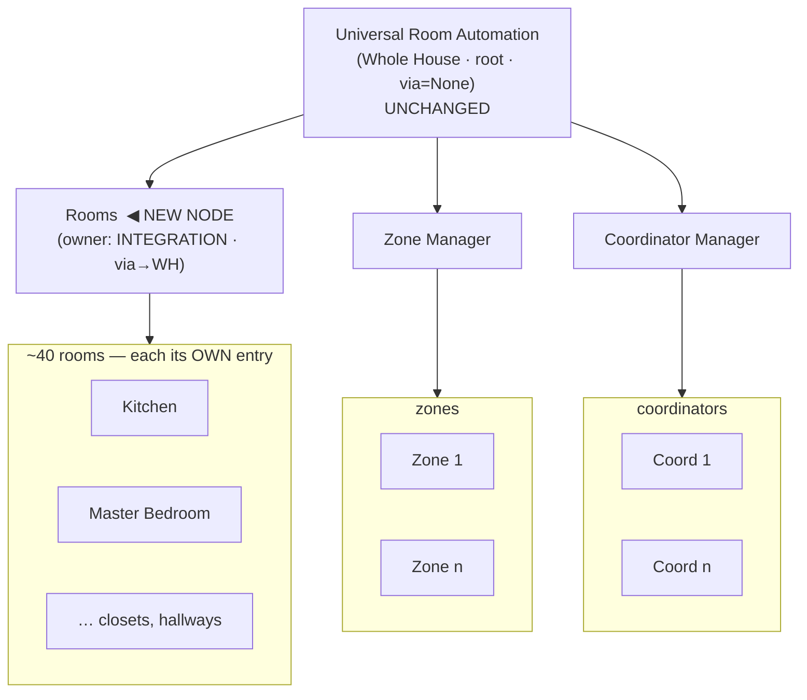

# Device-tree TARGET (proposed) — URA-INTEGRATION-ARRANGEMENT-1

Same diagram style as `docs/architecture/DEVICE_TREE.md §2`. This is the PROPOSED target (not yet built); DEVICE_TREE.md remains the canonical CURRENT state until this ships.

## CURRENT (today — from DEVICE_TREE.md §2)
```
Universal Room Automation (Whole House)        [INTEGRATION entry · root · via_device=None]
├── Coordinator Manager (CM)                   [CM entry]
│     └── Coordinator 1 … Coordinator n         (via_device → CM)
├── Zone Manager (ZM)                          [ZM entry]
│     └── Zone 1 … Zone n                        (via_device → ZM)
└── Room 1 … Room ~40                           (each its OWN entry · via_device → Whole House DIRECTLY)
                                                 ^^^ rooms hang straight off the House — NO grouping node;
                                                     they look independent, asymmetric with CM/ZM.
```

## TARGET (proposed — House stays root, add a Rooms node)
```
Universal Room Automation (Whole House)        [INTEGRATION entry · root · via_device=None · UNCHANGED · keeps ~80 aggregation entities]
├── Rooms   ◀── NEW NODE                        [owned by INTEGRATION entry · via_device → Whole House]
│     └── Room 1 … Room ~40                      (each its OWN entry · via_device → Rooms)   ◀── RE-NESTED (was → Whole House)
├── Zones (Zone Manager)                        [ZM entry · UNCHANGED]
│     └── Zone 1 … Zone n                        (via_device → ZM)
└── Coordinators (Coordinator Manager)          [CM entry · UNCHANGED]
      └── Coordinator 1 … Coordinator n          (via_device → CM)
```



## The 'upgrade' difference (this is the whole change)
| | CURRENT | TARGET |
|---|---|---|
| Rooms grouping node | **none** — rooms nest directly under Whole House | **new `Rooms` node** under Whole House |
| Room `via_device` | → Whole House (flat, look independent) | → **Rooms** (grouped, symmetric with Zones/Coordinators) |
| Symmetry | rooms are the odd one out (CM & ZM have parent nodes; rooms don't) | all three groups (Rooms/Zones/Coordinators) hang off House the same way |
| Whole House node | root, ~80 entities | **UNCHANGED** (still root, still owns its ~80 entities) |
| Zones / Coordinators | ZM / CM nodes | **UNCHANGED** |
| Ownership | rooms owned by their own entries | **UNCHANGED** — rooms still owned by their own room entries; the new `Rooms` node is INTEGRATION-owned. This is a **pure `via_device` (display-nesting) change + one new grouping node**, NOT an ownership migration. |

**One-line:** the upgrade adds a single **`Rooms`** grouping node so rooms stop hanging flat off the House and instead nest `House → Rooms → Room`, matching how `House → Coordinators → Coordinator` and `House → Zones → Zone` already work. Nothing else in the tree moves.

## Mechanism (from the excavation, for the plan)
- Add `(DOMAIN,"rooms") → (DOMAIN,"integration")` to `PARENT_MAP` (`_devices.py:124`); create the Rooms device (INTEGRATION-owned) at setup (mirror the CM node create at `__init__.py:4333`).
- Change the room fall-through in `_resolve_parent_identifier` (`_devices.py:158`) from `(DOMAIN,"integration")` → `(DOMAIN,"rooms")`; the existing D-NEST sweep re-stamps every room's `via_device_id`. **Imperative `async_update_device(via_device_id=…)` only** (HA 2026.9; INV-NEST).
- **Prerequisite:** the sweep-counter latch fix (`DEVICE-TREE-SWEEP-COUNTER-LIFETIME-LATCH-1`) — a dead sweep won't stamp a late-appearing room under the new Rooms node.
- "Reload" on the Rooms node = iterate the ~40 room entries (`async_reload(room_entry_id)` each) — **NOT** an INTEGRATION-entry reload (that's the outage path).
- INV-NEST update: rooms → Rooms → Whole House (was rooms → Whole House).

## Blast radius
Clean/low-risk (via_device axis + one new node + the sweep-fix). Does NOT touch the INTEGRATION reload path (that's the separate Tier-3 perf work). No ownership migration → avoids the v5.94.x device-registry hazard class.
